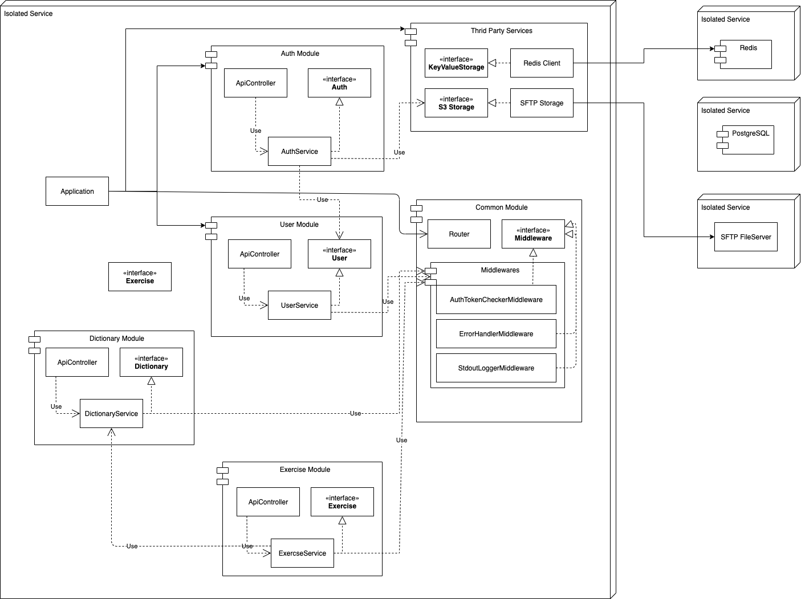

# Архитектура

Сейчас приложение представляет из себя модульный монолит, с заделом на дальнейший распил на микросервисы

Redis используется для хранения сессий

PostgerSQL для хранения всех данных

SFTP сервер будет использоваться как сторедж для бинарных данных

